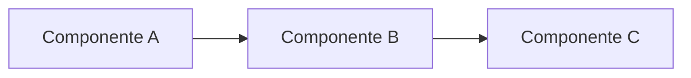

# RFC Template — ClubCore

> Template para Request For Comments. Usar cuando necesites proponer
> un cambio significativo y querés input de stakeholders antes de
> tomar la decisión (que se canoniza después como ADR).
>
> No usar para sprints normales (eso va por SPRINT-PLAN.md) ni para
> decisiones que ya están claras (eso va directo a ADR).

---

## Cómo usar este template

1. Copiar este archivo a `docs/rfcs/<YYYY-MM-DD>-<slug-corto>.md`.
2. Llenar todas las secciones. Marcar el RFC como `Status: Draft`.
3. Compartir con stakeholders (mínimo: Yair + arquitecto).
4. Recibir comentarios. Iterar el RFC.
5. Cuando hay consenso, marcar `Status: Accepted`.
6. Crear ADR en `docs/DECISIONS.md` con la decisión final.
7. Mover RFC a `docs/rfcs/archived/` o eliminarlo.

Si no hay consenso después de 2 iteraciones, marcar `Status: Rejected`
y archivar.

---

## Header [obligatorio]

| Campo | Valor |
|---|---|
| **ID** | RFC-YYYY-MM-DD-NN |
| **Título** | <una frase descriptiva> |
| **Autor** | <nombre> |
| **Fecha de creación** | YYYY-MM-DD |
| **Última revisión** | YYYY-MM-DD |
| **Status** | Draft / Under Review / Accepted / Rejected / Superseded |
| **ADR resultante** | <link al ADR si fue aceptado, vacío si no> |
| **Stakeholders consultados** | <lista de personas> |

---

## Resumen ejecutivo [obligatorio]

<2-3 párrafos. Qué propongo, por qué, qué cambia si se aprueba.
Si alguien lee solo este resumen y nada más, debe poder dar opinión.>

---

## Motivación

### Problema que estamos resolviendo

<Descripción concreta del problema actual. Datos si los hay
(métricas, casos reales).>

### Por qué resolverlo ahora

<Por qué no más adelante. Qué pasa si NO actuamos.>

### Quiénes están afectados

<Usuarios, devs, sistemas. Quién gana qué si esto se aprueba.>

---

## Diseño propuesto [obligatorio]

### Vista de alto nivel

<Descripción en prosa de la solución. Incluir un diagrama Mermaid si
aporta claridad.>



### Detalle técnico

<Modelado de datos, APIs, flujos. Suficiente detalle como para que
un dev pueda implementar a partir de acá.>

#### Cambios en DB

```sql
-- Tablas nuevas
CREATE TABLE ...

-- Columnas nuevas
ALTER TABLE ...
```

#### Cambios en API

| Endpoint | Método | Cambio |
|---|---|---|
| /api/... | GET | Nuevo |
| /api/... | POST | Modificado |

#### Cambios en UI

<Descripción + screenshots/wireframes si aplica.>

### Migración

<Plan de migración desde el estado actual al estado propuesto.
¿Es backwards-compatible? ¿Requiere data migration? ¿Hay riesgo
de downtime?>

---

## Alternativas consideradas

### Alternativa 1: <nombre>

**Descripción:** <qué sería>

**Pros:**
- ...

**Contras:**
- ...

**Por qué se descartó:**
<razón concreta>

### Alternativa 2: <nombre>

<idem>

### Status quo (no hacer nada)

**Pros:**
- Cero esfuerzo.

**Contras:**
- <qué problemas seguimos teniendo>

---

## Trade-offs explícitos

<Cosas concretas que ganamos vs cosas concretas que perdemos.
Sin endulzar.>

| Ganamos | Perdemos |
|---|---|
| <cosa concreta> | <cosa concreta> |
| ... | ... |

---

## Preguntas abiertas

<Cosas que el autor del RFC no resolvió o no decidió. Los stakeholders
votan o aportan opinión.>

1. <Pregunta concreta>
2. ...

---

## Plan de adopción

Si el RFC se aprueba:

| Hito | Sprint planeado | Responsable |
|---|---|---|
| Crear ADR canonizando la decisión | <sprint o "antes de empezar"> | Arquitecto |
| Implementar X | <sprint> | Code |
| Migrar datos existentes | <sprint> | Code |
| Comunicar cambio a usuarios | <sprint> | Arquitecto |

---

## Comentarios de stakeholders

<Esta sección se llena durante la fase de review. Cada stakeholder
agrega su comentario firmado.>

### Yair — 2026-XX-XX

<comentario>

### Arquitecto — 2026-XX-XX

<comentario>

---

## Resolución final

<Si el RFC se acepta: link al ADR canonizado. Si se rechaza: razón
del rechazo.>
