# ClubCore — System Design

> Vista unificada del sistema. Componentes, flujos críticos,
> dependencias externas, multi-tenancy en acción, seguridad,
> performance, escalabilidad y deuda arquitectónica.
>
> Para detalle de convenciones técnicas ver ARCHITECTURE.md.
> Para controles de seguridad detallados ver SECURITY.md.
> Para objetivos numéricos de performance ver PERFORMANCE.md.
> Este documento referencia y unifica, no duplica.
>
> Mantenido por el arquitecto.
>
> Última actualización: 12 de mayo de 2026.

---

## 1. Cómo usar este documento

Audiencias previstas:

- **Yair:** entender el sistema completo en 1 lectura.
- **Devs externos / consultores / futuros colaboradores:** onboarding técnico.
- **Inversores / partners técnicos:** vista de alto nivel para pitch.
- **Arquitecto:** mantener actualizado cuando cambia un componente principal.

Cómo leerlo:

1. Lectura completa la primera vez: ~30-45 min.
2. Consulta puntual posterior: usar tabla de contenidos.
3. Al cambiar un componente principal: actualizar las secciones afectadas.

---

## 2. Vista 10,000 metros

ClubCore es una plataforma SaaS multi-tenant para clubes deportivos,
construida sobre Next.js + Supabase + Vercel, con arquitectura de 3
capas (Troncal universal + Módulos componibles + Verticales como
presets) y modo mock-first para integradores externos hasta FASE 16.

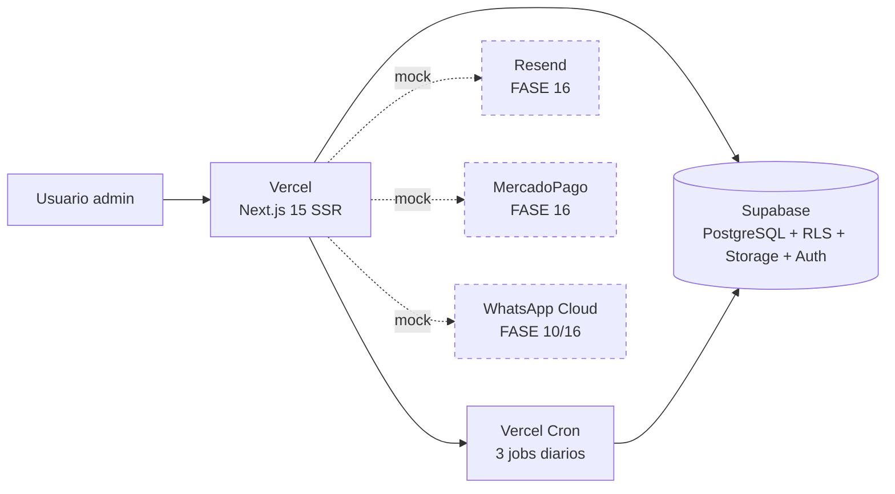

Líneas punteadas = integradores externos en modo mock hoy (ADR-035).
El switch a producción real es centralizado en FASE 16.

---

## 3. Stack técnico

Ver ARCHITECTURE.md §1 para detalle completo. Resumen ejecutivo:

| Capa | Tecnología | Estado |
|---|---|---|
| Frontend | Next.js 15 (App Router) | Producción |
| UI | React 19 + shadcn v4 + base-ui + Tailwind 4 | Producción |
| DB + Auth + Storage | Supabase (PostgreSQL 15+) | Producción |
| Hosting | Vercel | Producción |
| Email | Resend | Mock (FASE 16) |
| Pagos | MercadoPago | Mock (FASE 16) |
| Crons | Vercel Cron | Producción (3 jobs activos) |
| Tipos | TypeScript estricto | Producción |

Stack explícitamente excluido: Redis, message queues, microservicios,
ORMs, tRPC, GraphQL.

---

## 4. Arquitectura de capas

ClubCore aplica ADR-031 — 3 capas lógicas:

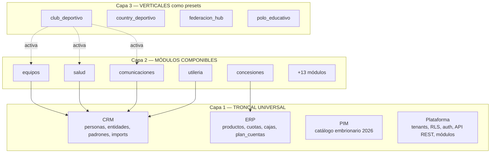

**Reglas inviolables (ADR-031):**

1. Una sola fuente de verdad por concepto (troncal lo posee).
2. Módulos portables: copiar carpeta = mover módulo.
3. Comunicación entre módulos solo via eventos o API pública.
4. Verticales son metadata, no código.
5. Reemplazabilidad por adapters externos.
6. Schema enforcement automático.

Detalle: ARCHITECTURE.md §3.

---

## 5. Componentes principales

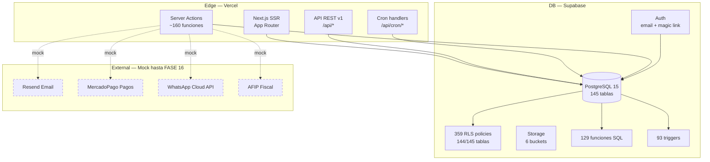

### 5.1 Roles de los componentes

| Componente | Responsabilidad | Tecnología |
|---|---|---|
| Next.js SSR | Renderizar UI server-side, ejecutar server actions | Vercel Edge + Node.js runtime |
| API REST v1 | Endpoints públicos para integraciones externas | Next.js API routes |
| Cron handlers | 3 cron jobs diarios (apto/cuota vencimientos) | Vercel Cron + service role |
| Server Actions | Mutaciones invocadas desde UI (~160 actions) | Next.js server actions |
| PostgreSQL | Single source of truth para todo dato del negocio | Supabase managed Postgres |
| RLS policies | Aislamiento multi-tenant a nivel DB | Postgres RLS |
| Auth | Login email + magic link | Supabase Auth |
| Storage | Archivos (fotos utilería, documentos, etc.) | Supabase Storage |
| Functions SQL | Lógica compleja embebida (cuotas, dedup, etc.) | PL/pgSQL |
| Triggers | Sincronización automática (audit, updated_at) | PL/pgSQL |

---

## 6. Flujos críticos

### 6.1 Login + sesión

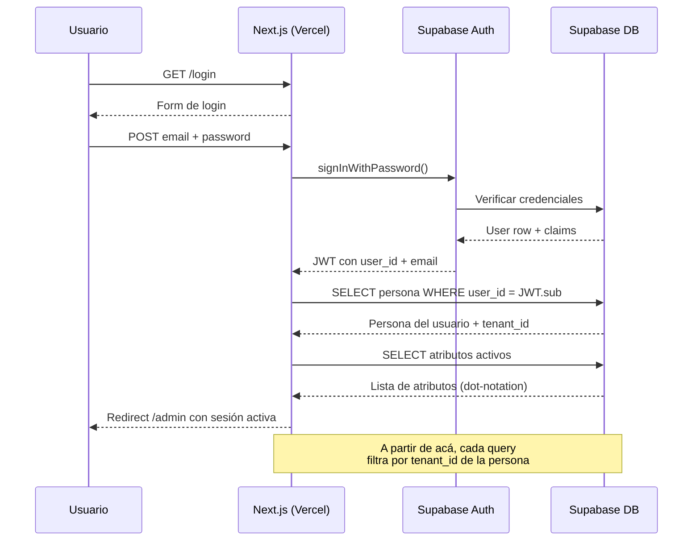

Notas:
- El `tenant_id` del usuario se infiere desde `personas.tenant_id` via JOIN con `user_id`.
- Migración a JWT con tenant_id custom claim: Sprint 17b (futuro).
- Atributos en dot-notation (ADR-036) determinan permisos en cada page.

### 6.2 Envío masivo de comunicación

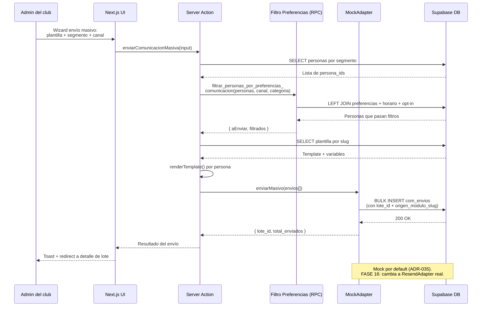

Decisiones clave de este flujo:
- **Filtrado por preferencias antes del insert** (no después, no se inserta para luego borrar).
- **`origen_modulo_slug` en columna nativa, no en metadata** (ADR-037).
- **Categoría `transaccional` ignora opt-out** (legal — recordatorios obligatorios).

### 6.3 Cron de vencimientos (diario 9 AM ART)

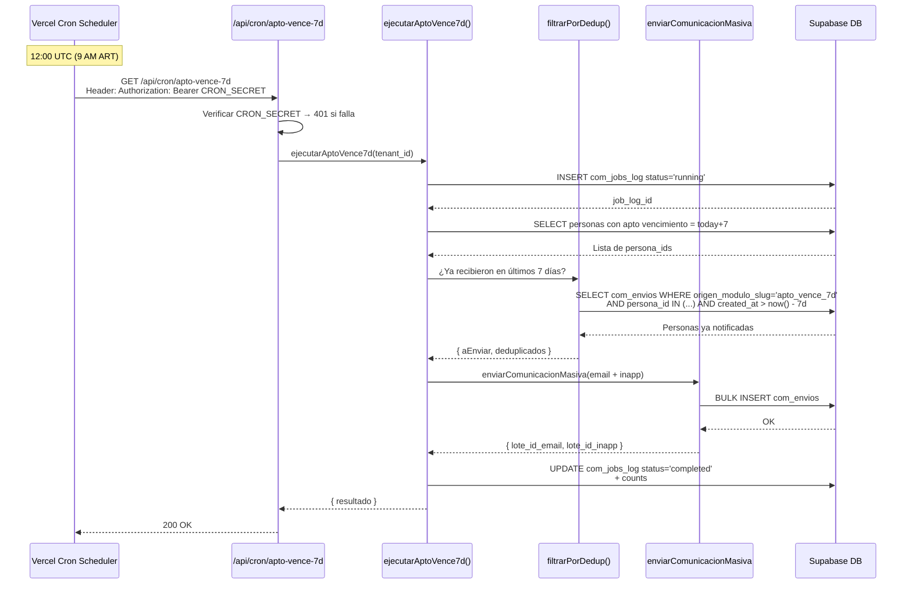

3 cron jobs activos hoy: `apto_vence_7d`, `cuota_vence_7d`, `cuota_vencida_7d`.
Schedules staggered: 12:00 / 12:05 / 12:10 UTC.

Trazabilidad completa via `com_jobs_log` + `origen_modulo_slug` en `com_envios`.

### 6.4 Import declarativo (pipelines)

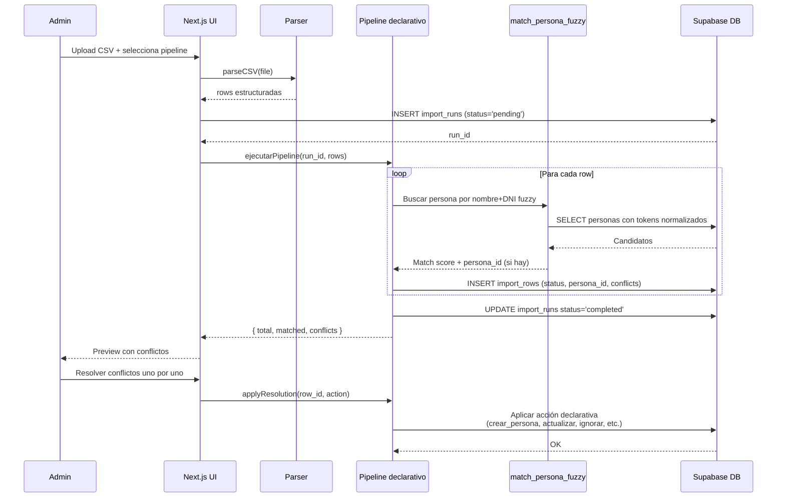

Decisión arquitectónica clave (ADR-003): **importadores son
declarativos, no código**. Cada pipeline nuevo es config en DB
(`import_pipelines`), no código nuevo.

Funciones SQL clave:
- `match_persona_fuzzy`: matching tolerante a apóstrofes, acentos,
  abreviaciones (ADR-004).
- `normalize_name`: tokenización + lowercase + sin acentos.
- `resolver_o_crear_equipo`: para imports de jugadores que mencionan
  equipos no creados.

### 6.5 Cobranza de cuotas

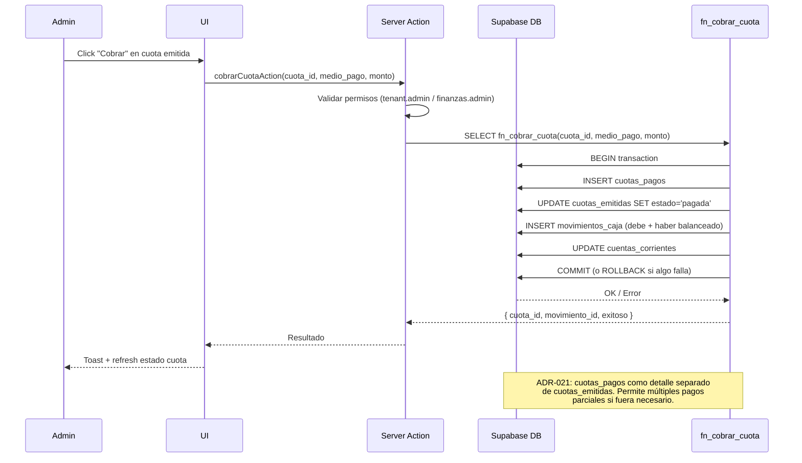

Notas:
- **Idempotencia obligatoria** (D8): re-ejecutar la cobranza con misma cuota no genera doble movimiento.
- **MercadoPago automático**: futuro Sprint 15d. Hoy todo manual.
- **Aislamiento concesionarios** (ADR-025): ventas de concesionarios NO tocan `movimientos_caja`.

---

## 7. Multi-tenancy en acción

### 7.1 Cómo se aísla un tenant

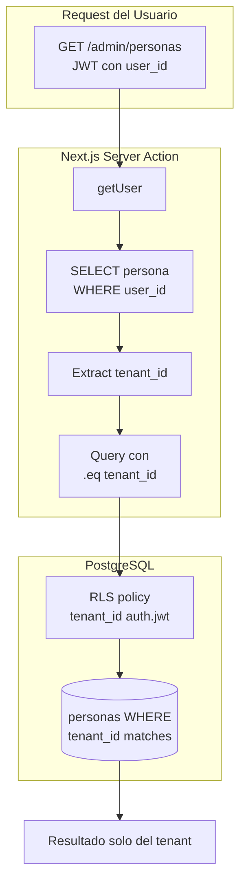

**Defensa en profundidad**: 3 capas de aislamiento:

1. **Capa aplicación** (R-MT3): código siempre filtra `.eq('tenant_id', tenant_id)`.
2. **Capa DB** (R-MT2): RLS policy filtra por `tenant_id` del JWT.
3. **Capa migrations** (R-MT1): toda tabla de negocio DEBE tener `tenant_id`.

Si alguna capa falla, las otras 2 contienen el daño. Sprint 17b
migra a JWT con tenant_id custom claim para reforzar la defensa.

### 7.2 Hindu como tenant único en MVP

Hoy:
- 1 tenant productivo: Hindu Club.
- UUID: `11111111-1111-1111-1111-111111111111`.
- Hardcoded en `lib/tenant.ts` para desarrollo.

Sprint 12.1 (FASE 12 — Onboarding tenant + branding): self-service
de creación de tenants. Hardcoded desaparece.

---

## 8. Dependencias externas

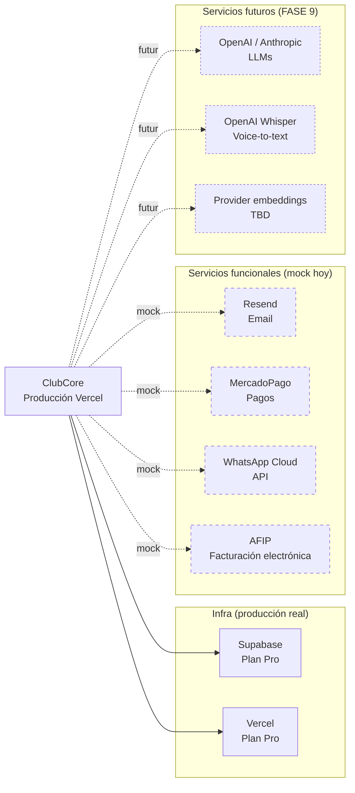

### 8.1 Estrategia mock-first (ADR-035)

Todo servicio externo opera en modo `MockAdapter` hasta FASE 16.
Adapter pattern: interface tipada + `MockAdapter` por default +
`ProductionAdapter` activado por env var en FASE 16.

Ver `modules/comunicaciones/lib/adapters/` como patrón de referencia.

### 8.2 Costos infra hoy

| Servicio | Plan | Costo mensual estimado USD |
|---|---|---|
| Supabase | Pro | 25 |
| Vercel | Pro | 20 |
| Dominios | varios | 5 |
| **Total infra hoy** | — | **~50** |

### 8.3 Costos esperados FASE 16 (servicios reales)

| Servicio | Volumen estimado (Hindu) | Costo USD/mes |
|---|---|---|
| Resend | 50,000 emails | 20 |
| MercadoPago | ~4% sobre cobros (no infra fija) | — |
| WhatsApp Cloud | Por mensaje (free tier 1k/mes) | 0-30 |
| OpenAI/Anthropic (FASE 9) | Variable | ~130 (ver SYSTEM-PROMPTS §5.3) |
| **Total post FASE 16** | — | **~230 USD/mes/tenant** |

Refinable cuando haya métricas reales.

---

## 9. Seguridad

Ver SECURITY.md para detalle completo. Resumen ejecutivo:

### 9.1 Controles activos

| Control | Implementación | Cobertura |
|---|---|---|
| RLS multi-tenant | Postgres RLS en cada tabla de negocio | 144/145 tablas (99.3%) |
| Service role aislada | Solo en cron handlers + server actions específicas | 100% |
| Auth con magic link / password | Supabase Auth | Login obligatorio |
| Atributos en dot-notation (ADR-036) | Checks en server actions | En migración (3 módulos pendientes FASE 15) |
| Audit log | `audit_log` table con triggers | Tablas sensibles (salud, credenciales) |
| Cron secrets | CRON_SECRET en Vercel env | 3/3 cron endpoints |
| Soft-delete (ADR-030) | `deleted_at` en todas las tablas de negocio | 100% |

### 9.2 Defensa contra prompt injection (futuro FASE 9)

Cuando se agreguen agentes IA conversacionales (FASE 9.2 chatbot, etc.):

- Regla S-4 de SYSTEM-PROMPTS.md aplicable.
- Logging obligatorio en `audit_log` con `event_type='prompt_injection_attempt'`.
- Set de prompts de regresión para validar defensa post-modificación.

### 9.3 Riesgos de seguridad conocidos (deuda)

| Riesgo | Severidad | Sprint planeado |
|---|---|---|
| 1 tabla sin RLS habilitada (de 145) | Media | FASE 15 (auditar y habilitar) |
| Permission slugs underscore en 3 módulos | Media | FASE 15 (ADR-036) |
| `tenant_id` desde código vs JWT real | Media | Sprint 17b (migración a JWT custom claim) |
| Falta de rate limiting en API REST | Baja | FASE 11 (API pública) |
| Falta de WAF / DDoS protection | Baja | FASE 11 + Vercel Pro (built-in básico) |

---

## 10. Performance

Ver PERFORMANCE.md para objetivos detallados. Resumen ejecutivo:

### 10.1 Objetivos (PERFORMANCE.md)

| Métrica | Objetivo | Estado actual |
|---|---|---|
| Time to First Byte (TTFB) | < 200ms | ~150ms (Vercel edge) |
| Largest Contentful Paint (LCP) | < 2.5s | ~1.8s |
| Server action median | < 500ms | ~300ms |
| Query DB típica (con index) | < 50ms | ~10-30ms |
| Build time | < 5 min | ~3 min |

### 10.2 Bottlenecks conocidos

| Bottleneck | Causa raíz | Mitigación |
|---|---|---|
| `personas` con 103 columnas | Mezcla CRM/salud/deportivo, deuda de 2027 | Migración cuando separar troncal |
| Página `/admin/personas` con 2,390 filas | Sin paginación server-side | Sprint pendiente, paginación con cursor |
| Función `match_persona_fuzzy` lenta | LIKE sin índice trigram | Agregar `pg_trgm` index (deuda) |
| Build con turbopack OOM | Memoria limitada en CI | Subir a Vercel Pro Plus si vuelve a fallar |

### 10.3 Cuándo escalar Supabase

Triggers concretos:
- DB CPU > 70% sostenido por 1h.
- Connections activas > 80% del pool.
- Query p95 > 200ms.
- Storage > 80% del cupo del plan.

Acción: upgrade del plan Supabase. Si llega a múltiples tenants
grandes, considerar shard (FASE 17 — multi-region).

---

## 11. Escalabilidad

### 11.1 Capacidad estimada con stack actual

| Escenario | Capacidad estimada | Bottleneck primero |
|---|---|---|
| 1 tenant (Hindu) | 10,000 personas | Ninguno (estamos en 2,390) |
| 10 tenants | 50,000 personas total | Plan Supabase Pro |
| 100 tenants | 500,000 personas total | Supabase Team plan + shard |
| 1,000 tenants | 5M personas | Multi-region + sharding por geo |

### 11.2 Camino de escalabilidad

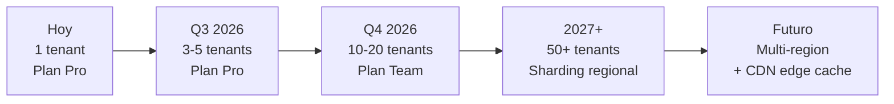

### 11.3 Decisiones que se difieren hasta tener escala real

- **Caché Redis:** no implementar hasta que p95 de queries críticas > 100ms sostenido.
- **CDN para assets dinámicos:** Vercel ya cachea estáticos. Dinámicos solo si LCP empeora.
- **Read replicas Supabase:** solo si DB CPU rojo.
- **Microservicios:** explícitamente excluido del stack. Monolito hasta 1,000 tenants.

---

## 12. Riesgos arquitectónicos conocidos (deuda)

Inventario actualizado en `CURRENT-STATE.md` §6. Resumen visual:

| Severidad | Cantidad | Áreas |
|---|---|---|
| Alta | 0 | — |
| Media | 4 | Permission slugs (FASE 15), tenant_id desde código (17b), `personas` 103 cols (2027), DB métricas desync (resuelto DOCS-1) |
| Baja | 10+ | Naming inconsistencias, índices faltantes, monolito de actions, etc. |

Ver `CURRENT-STATE.md` §6 para lista completa con sprint planeado.

### 12.1 Riesgos NO documentados como deuda pero presentes

1. **Lock-in con Supabase**: si Supabase cambia precios drásticamente
   o cierra, migrar a self-hosted Postgres es 2-4 semanas de trabajo.
   Mitigación: stack es Postgres puro (Supabase no agrega features
   propietarias críticas).

2. **Lock-in con Vercel**: similar. Migración a Cloudflare Workers /
   Railway / Render es 1-2 semanas. Next.js es portable.

3. **Dependencia de Claude / OpenAI** (futuro FASE 9): mitigada por
   multi-provider strategy (SYSTEM-PROMPTS.md §5.2).

4. **Persona única para credenciales del proyecto**: hoy Yair es el
   único con acceso a Vercel, Supabase, GitHub, dominios. Bus factor = 1.
   Mitigación a evaluar: bóveda de secrets + 1 backup admin (Kate).

---

## 13. Roadmap arquitectónico

Las decisiones arquitectónicas grandes están en `ROADMAP.md` con
fase asociada. Vista resumida:

| Fase | Cambio arquitectónico | Estado |
|---|---|---|
| FASE 11 | API REST pública v1 + rate limiting | Pendiente |
| FASE 12 | Self-service tenant onboarding + branding | Pendiente |
| FASE 15 | Hardening: RLS audit, permission slugs, DA-1 a DA-5 | Pendiente |
| FASE 16 | Switch a integradores reales (Resend, MP, WA, AFIP) | Pendiente |
| FASE 17 | Multi-region + sharding (cuando aplique) | Postergado |
| Sprint 17b | JWT custom claim con tenant_id | Pendiente |
| 2027 | Separación física Troncal / Vertical | Postergado |

---

## 14. Histórico de actualizaciones

| Fecha | Sprint | Cambios |
|---|---|---|
| 2026-05-12 | DOCS-4 | Versión inicial con 8 diagramas Mermaid (componentes + 5 flujos + multi-tenant + dependencias + escalabilidad). |
